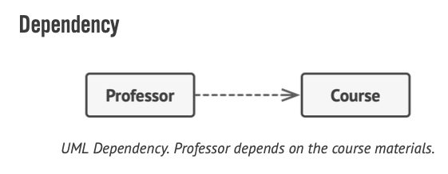

## Reading UMLs

- Simple arrows indicate that one class usees another
  
- Arrows with empty heads indicate inheritance (from subclass to superclass)
- Arrows with empty triangle heads and dashed lines indicate that classes implement an interface
  
- Normal dotted arrows indicate dependency
  
