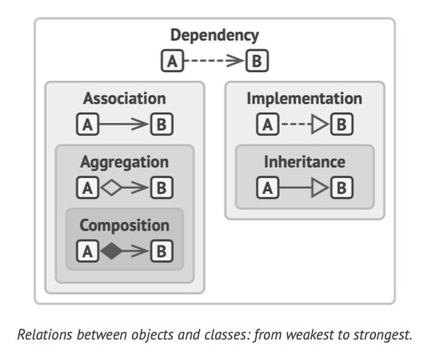

# Relations between objects

### Terms

**Method signature**: The signature of a method consists of the name of the method and the type and kind (value, reference, or output) of each of its formal parameters

## Dependency

- Weakest type of relations
- Changes in one class may result in changes in another
- Dependency becomes weaker when using interfaces or using abstract classes
  

## Association

- also a dependency but stronger
- an object always has access to the other (permanent link)
- could be represented in a field as a link to another object
- or a method that returns another object
- association between interfaces are impossible as they do not have fields but only methods
  ```
  class Professor is
  field Student student //...
  method teach(Course c) is
  // ...
  this.student.remember(c.getKnowledge())
  ```
- Course class is a dependency of Professor class since it will break if Course signature method is changed
- But not always have access to Course class and it is provided only through an argument
- Student class is also a dependency but a stronger one as Professor class has a permanent link to it (relationship)
  

## Aggregation

- One-to-many
- Many-to-many
- Whole-part
- Between multiple relations
- One object is a container that "has" many objects
- The components **can** exist without the container
- The components **can** belong to other containers
- Arrow with empty diamond at the container end
  

## Composition

- A type of aggregation
- One object is **composed** of one or more instances of the other
- The component **cannot exist** without the container
- Arrow looks the same as aggregation but with a filled diamond
  

## Summary

- Dependency: Class A can be affected by changes in class B
- Association: Object A knows (references) about object B. Class A depends on Class B
- Aggregation: Object A knows about object B and has a collection of B. Class A depends on B
- Composition: Object A knows about object B, consists of B, and manages B's life cycle. Class A depends on B
- Implementation: Class A defines methods declared in interface B. Object A can be treated as B. Class A depends on interface B
- Inheritance: Class A inherits interface and implementation of class B but can be extended. Object A can be treated as B. Class A depends on Class B
  
